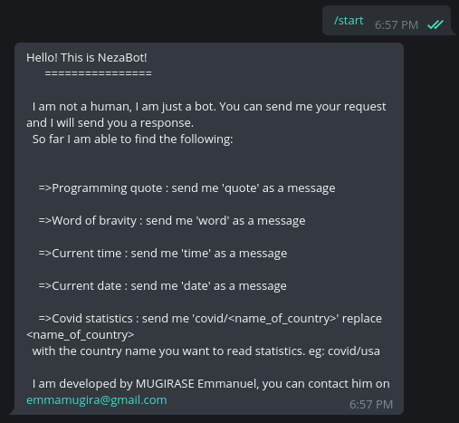
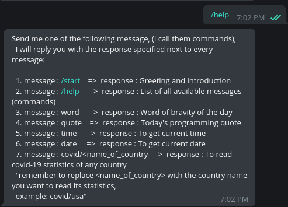
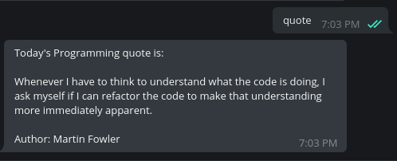
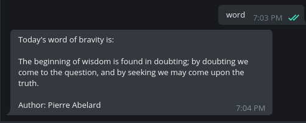
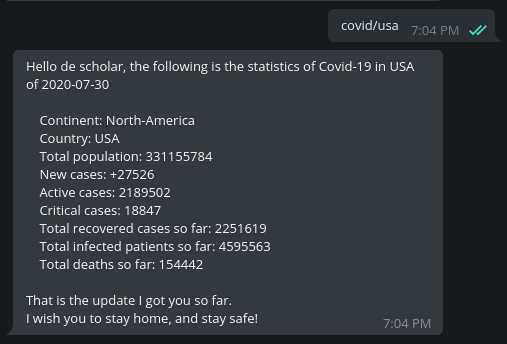
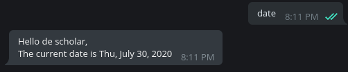

# whatsapp-bot
    

## Description
`whatsapp-bot` is a chatbot built on top of [Telegram messenger](https://telegram.org/), this means you access it via [Telegram messenger](https://telegram.org/). It is able to help you with the following: 
- Giving you statistics of COVID-19 (Corona virus)
- Giving you word of bravity
- Telling you programming quote
- Telling the current time
- Telling you the current date

## Built with
* [Ruby](https://www.ruby-lang.org/en/)

## Screenshots
The following screenshots, show you the command and it's response (Command : header, response:screenshot)
|`/start`|`/help`|`quote`|
|-|-|-|
||||

|`word`|`covid/usa`|`date`|
|-|-|-|
||

## Contributions

There are two ways of contributing to this project:

1.  If you see something wrong or not working, please check [the issue tracker section](https://github.com/descholar-ceo/whatsapp-bot/issues ), if that problem you met is not in already opened issues then open the issue by clicking on `new issue` button.

2.  If you have a solution to that, and you are willing to work on it, follow the below steps to contribute:
    1.  Fork this repository
    1.  Clone it on your local computer by running `git clone https://github.com/your-username/whatsapp-bot.git` __Replace *your username* with the username you use on github__
    1.  Open the cloned repository which appears as a folder on your local computer with your favorite code editor
    1.  Create a separate branch off the *master branch*,
    1.  Write your codes which fix the issue you found
    1.  Commit and push the branch you created
    1.  Raise a pull request, comparing your new created branch with our original master branch [here](https://github.com/descholar-ceo/whatsapp-bot)

## Author (s)
### 1. MUGIRASE Emmanuel
* Github: [@descholar-ceo](https://github.com/descholar-ceo)
* Twitter: [@descholar3](https://twitter.com/descholar3)
* LinkedIn: [MUGIRASE Emmanuel](https://www.linkedin.com/in/mugirase-emmanuel-a90b49143)

## Show your support 
Give a ⭐️ if you like this project!

## Acknowledgment
* [Microverse](https://microvese.org): My great school

